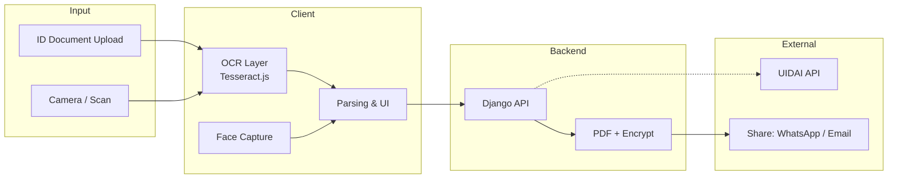
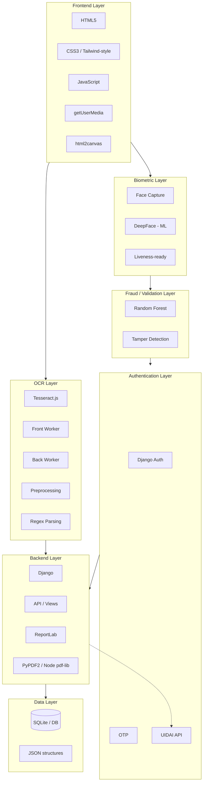
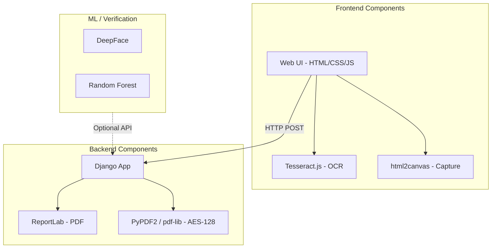
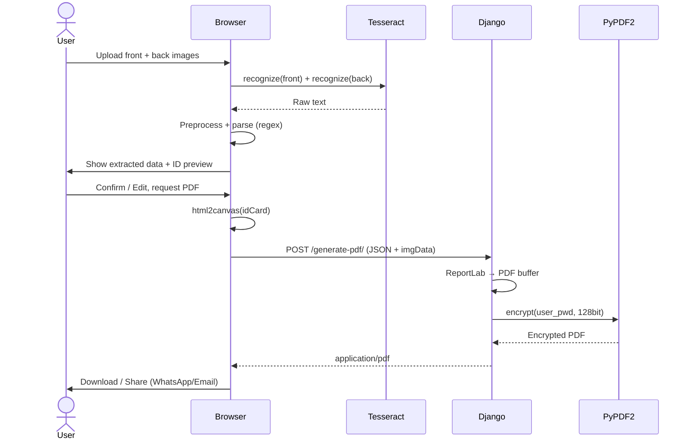
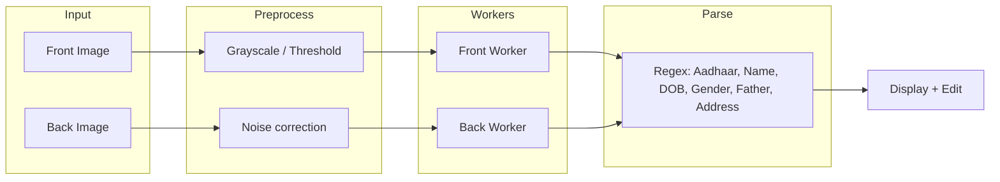
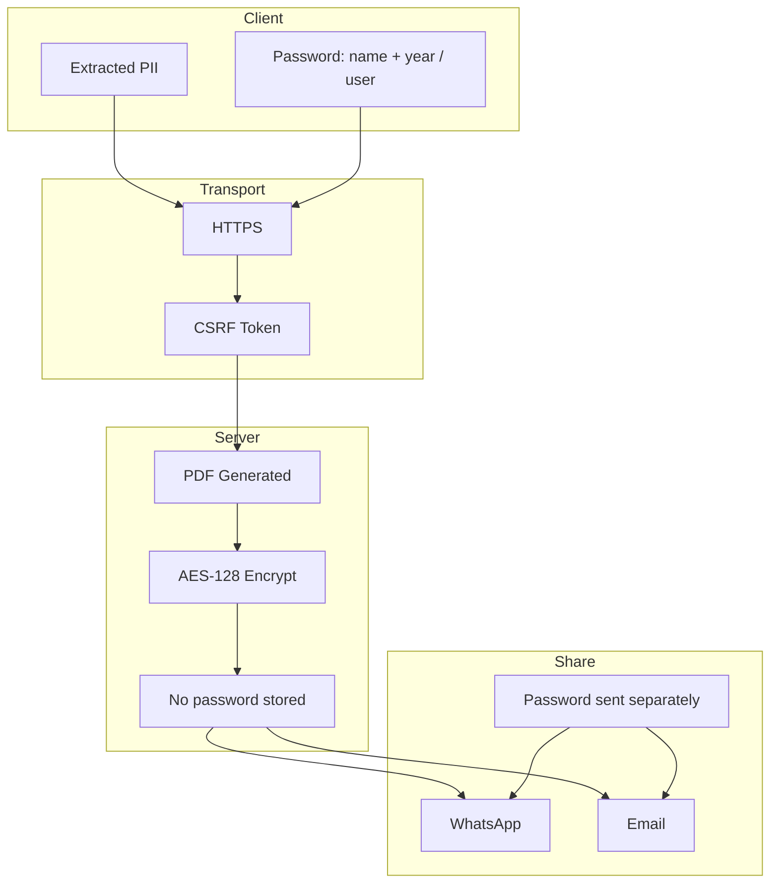
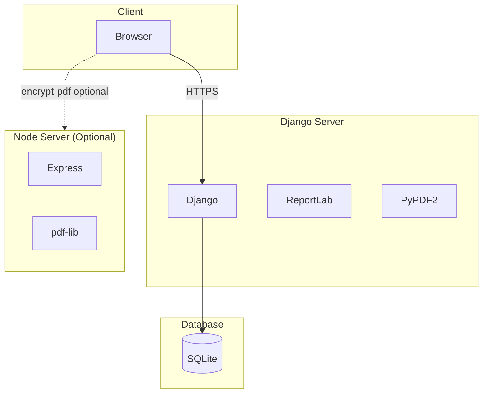

# Cognitive e-KYC — System Architecture

This document describes the **modular layered architecture** of the Cognitive e-KYC system and uses **Mermaid** diagrams for visualization (supported on GitHub, GitLab, and most Markdown viewers).

---

## 1. High-Level System Flow

End-to-end flow from document upload to encrypted ID card and sharing.

---

## 2. Layered Architecture

---

## 3. Component Diagram

---

## 4. Sequence: Upload → Extract → PDF

---

## 5. OCR Pipeline (Dual Workers)

---

## 6. Security & Data Flow

---

## 7. Deployment View (Hybrid)

---

## 8. Module Summary

| Layer | Responsibility | Key artifacts |
|-------|----------------|----------------|
| **Frontend** | UI, upload, camera, capture | `templates/*.html`, `static/js/script.js`, `static/*.css` |
| **OCR** | Extract text from front/back | Tesseract.js workers, `preprocessOcrText`, `parseAadhaarData` |
| **Biometric** | Face capture; verification in ML | `getUserMedia`, `ML Algorithms/Verification.ipynb` |
| **Fraud / Validation** | Consistency, tamper hints | Random Forest in `ML Algorithms/` |
| **Authentication** | Login, session; UIDAI (roadmap) | `ekyc/views.py`, Django auth |
| **Backend** | API, PDF, encryption | `ekyc/views.py`, `node_backend/server.js` |
| **Data** | User and session data | Django DB, SQLite |

---

## 9. Diagram Conventions

- **Solid arrows:** Synchronous or direct dependency.
- **Dashed arrows:** Optional or external integration (e.g. UIDAI, Node service).
- **Mermaid:** Render on [GitHub](https://github.com), [GitLab](https://gitlab.com), or [Mermaid Live](https://mermaid.live) for best compatibility. If a diagram does not render, paste its code block into Mermaid Live to view it.

For file-level and technical details, see [docs/TECHNICAL_OVERVIEW.md](docs/TECHNICAL_OVERVIEW.md) and [docs/MODULES.md](docs/MODULES.md).
