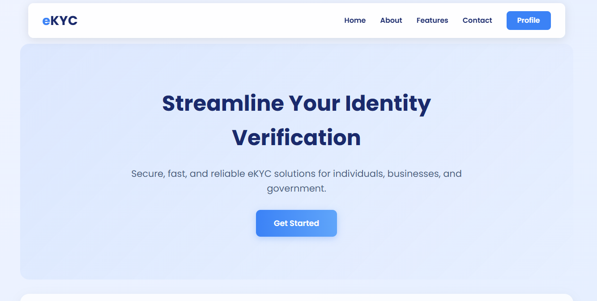
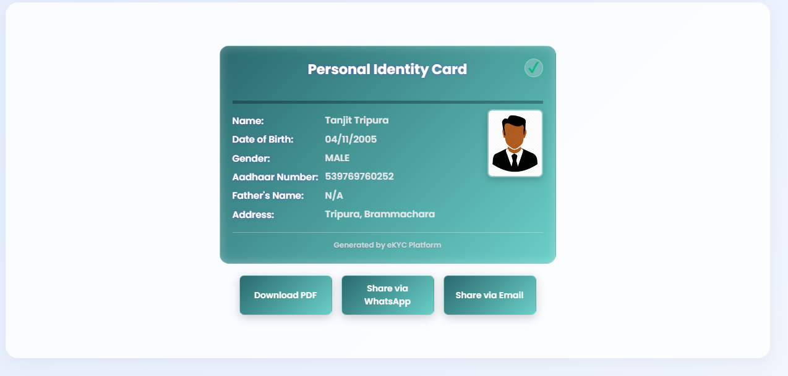

# Cognitive e-KYC: AI-Powered Biometric & Digital Identity Verification System

[](LICENSE)

> **A convergence of Biometric Forensics and Digital Identity Validation.**

 

---

## 1. Project Overview

**Cognitive e-KYC** is an AI-driven digital identity verification system designed to automate Know Your Customer (KYC) processes using:

- **OCR-based document data extraction** (Aadhaar front/back)
- **Face capture** with liveness-ready flow (webcam / upload)
- **PII-aware workflows** with structured parsing and encryption
- **Machine learning fraud detection** (Random Forest validation — see ML module)
- **UIDAI Aadhaar Authentication API** integration (design/roadmap)
- **Encrypted digital ID card** generation (AES-128) with secure sharing

The system reduces manual verification workload and enables **secure, scalable, near real-time** digital identity validation. End-to-end verification targets **under 10 seconds** under stable network conditions.

---

## 2. Problem Statement

Traditional KYC systems suffer from:

| Issue | Solution in Cognitive e-KYC |
|-------|-----------------------------|
| Manual verification delays | Automated OCR + optional API verification |
| Document forgery risks | Structured validation + ML fraud detection (roadmap) |
| Identity spoofing | Face capture + liveness-ready flow; DeepFace in ML pipeline |
| Human error in data entry | Regex-based parsing + editable extracted fields |
| Lack of secure data sharing | AES-128 encrypted PDF; password sent separately |
| Heavy API dependency | Client-side OCR; offline fallback supported |
| Poor fraud detection | Random Forest validation (see `ML Algorithms/`) |

---

## 3. Key Features

- **Client-side OCR:** Tesseract.js with **dual Web Workers** (front + back) for parallel processing without blocking the UI.
- **Structured extraction:** Regex-based parsing for Aadhaar number, name, DOB, gender, father’s name, address; preprocessing and error correction (e.g. `5/0` → `S/O`).
- **Biometric-ready:** Webcam capture via `getUserMedia`; person photo on ID; DeepFace-based verification in `ML Algorithms/Verification.ipynb`.
- **Hybrid backend:** **Django** for auth, PDF generation, and business logic; optional **Node.js** microservice for PDF encryption (pdf-lib, AES-128).
- **Encrypted ID card:** ReportLab + PyPDF2 (Django) or Node (pdf-lib); password = first 4 uppercase letters of name + birth year, or user-defined.
- **Secure sharing:** Download encrypted PDF; share via WhatsApp or Email with password communicated separately.
- **Responsive UI:** HTML5, CSS3, JavaScript; Tailwind-style utility CSS; mobile-friendly.

---

## 4. High-Level Workflow

```text
1. User uploads ID proof (Aadhaar front + back) → scan/upload/camera
2. OCR (Tesseract.js) → dual workers, preprocessing, regex parsing
3. Face capture → webcam or upload; match vs ID photo (DeepFace in ML pipeline)
4. PII handling → structured fields; encryption for storage/sharing
5. Fraud/validation → ML-based checks (Random Forest in ML Algorithms)
6. UIDAI Aadhaar API → demographic/biometric/OTP (integration roadmap)
7. Encrypted digital ID card → PDF generation + AES-128; share via WhatsApp/Email
```

---

## 5. Technology Stack

| Layer | Technology |
|-------|------------|
| **Frontend** | HTML5, CSS3, JavaScript (ES6+), getUserMedia, html2canvas |
| **OCR** | Tesseract.js, image preprocessing, dual workers |
| **Face / ML** | DeepFace, OpenCV (see `ML Algorithms/Verification.ipynb`) |
| **Backend** | Django (Python) — auth, views, PDF generation |
| **Microservice** | Node.js + Express (optional PDF encryption with pdf-lib) |
| **PDF & encryption** | ReportLab, PyPDF2 (128-bit AES), pdf-lib (Node) |
| **Database** | SQLite3 (default); configurable in Django settings |
| **Security** | HTTPS, SSL/TLS, AES-128, CSRF, separate password transmission |

---

## 6. Project Structure

```text
Cognitive_Ekyc-main/
├── E_KYC/                    # Django project
│   ├── settings.py
│   ├── urls.py
│   ├── wsgi.py
│   └── asgi.py
├── ekyc/                     # Main Django app
│   ├── views.py              # Auth, PDF generation
│   ├── urls.py
│   ├── models.py
│   └── admin.py
├── node_backend/             # Optional Node.js PDF encryption service
│   ├── server.js
│   └── package.json
├── static/
│   ├── js/script.js          # OCR, UI, camera, PDF request
│   ├── style.css
│   ├── navbar.css
│   └── auth.css
├── templates/
│   ├── index.html
│   ├── login.html
│   ├── register.html
│   └── about.html
├── ML Algorithms/
│   └── Verification.ipynb    # DeepFace, Random Forest verification
├── docs/
│   ├── TECHNICAL_OVERVIEW.md
│   └── MODULES.md
├── ARCHITECTURE.md
├── README.md
├── manage.py
└── db.sqlite3
```

---

## 7. Getting Started

### Prerequisites

- Python 3.10+
- Node.js 18+ (optional, for Node encryption service)
- Modern browser with camera support (for live capture)

### Backend (Django)

```bash
# Create and activate a virtual environment (recommended)
python -m venv venv
source venv/bin/activate   # Windows: venv\Scripts\activate

# Install dependencies
pip install django reportlab PyPDF2

# Run migrations
python manage.py migrate

# Start Django server
python manage.py runserver
```

App: **http://127.0.0.1:8000**

### Optional: Node.js PDF encryption service

```bash
cd node_backend
npm install
node server.js
```

Runs on **http://localhost:3000** (use from frontend if configured).

### Frontend

- Open the Django-served URL; templates load from `templates/`, static files from `static/`.
- Tesseract.js and html2canvas are loaded via CDN in `templates/index.html`.

---

## 8. Performance Summary

| Component | Accuracy | Time (typical) |
|-----------|----------|-----------------|
| OCR (Tesseract.js) | ~87–90% (good quality images) | ~2 s |
| Face recognition (DeepFace, ML) | ~90% | ~2 s |
| Random Forest validation (ML) | ~92.2% | ~0.8 s |
| UIDAI API (when used) | Official records | ~1.2 s |
| PDF generation + encryption | — | ~1.2 s |
| **End-to-end** | — | **< 10 s** (target) |

---

## 9. Security Features

- 128-bit AES PDF encryption (PyPDF2 / pdf-lib).
- Password not stored with PDF; sent separately when sharing.
- HTTPS for production; CSRF protection (Django).
- User-controlled or derived password (name + birth year).
- PII kept in structured form; encryption at rest for generated documents.

---

## 10. Use Cases

- Banking & FinTech KYC  
- Insurance onboarding  
- Telecom verification  
- Government services  
- Healthcare identity validation  
- EdTech / corporate HR verification  

---

## 11. Limitations & Future Work

- **Limitations:** Tesseract can struggle with heavily degraded documents; lighting affects face recognition; optional UIDAI/API dependency; no blockchain or 3D liveness in current codebase.
- **Future:** CNN-based OCR, UIDAI integration, 3D liveness, blockchain-backed identity storage, chip-based smart ID reading, global compliance (e.g. GDPR, eIDAS).

---

## 12. Research Reference

Based on the IEEE research paper:

**"Cognitive e-KYC: A Convergence of Biometric Forensics and Digital Identity Validation"**

---

## 13. Documentation

- **[ARCHITECTURE.md](ARCHITECTURE.md)** — System architecture, layers, and Mermaid diagrams.
- **[docs/TECHNICAL_OVERVIEW.md](docs/TECHNICAL_OVERVIEW.md)** — Technical deep dive.
- **[docs/MODULES.md](docs/MODULES.md)** — Module-level description.

---

## 14. Contact & License

- **Contact:** [vedantkanoje794@gmail.com](mailto:vedantkanoje794@gmail.com)
